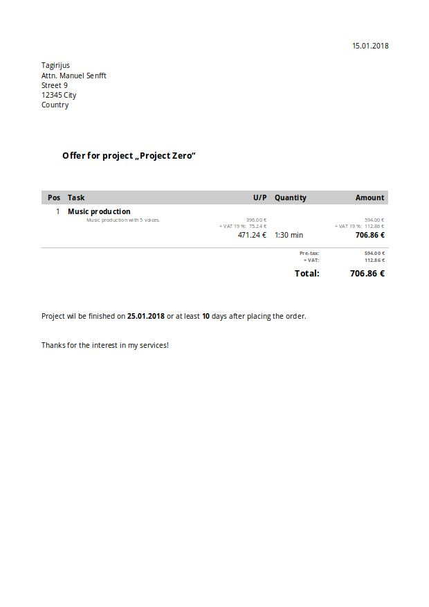

A programm for managing clients, projects and connected offers and invoices.

# Example workflow

# Example offer output

# In detail

The programm is meant to help self-employed freelancers with their project management. You can have a list of clients with metadata, connected projects to the clients with metadata and also offers and invoices connected to the projects. The offer module can have entries, which will calculate prices automatically - the invoice module is similar. In the end you can even export offers and invoices to open office format.

The frontend is made with my tweaked version of [npyscreen](https://github.com/Tagirijus/npyscreen/tree/NotifyInput).

# Installation

To be honest: a bit helpless here. I have installed my tweaked version of `npyscreen` in the system. I did it with this command in the terminal:

	pip3 install -U git+https://github.com/Tagirijus/npyscreen@NotifyInput

My freelance script is in any folder, which I start with `python3 run.py`.

This is probably totally noob-alike. Maybe somebody is going to improve it some day?

# Usage

Start the programm and open the menu with `Ctrl+X`. Then you have a help option for nearly every form of the progamm, which should help you.

# Client database converter

`general/convert_clients.py` is a simple command line programm to convert your old client database to the Freelance format and vice versa. Start the programm with `-h` or `--help` to see how it works.

# Important changes

- Since commit `4b0b9d2bf4df4859ff7d9fd39dab600625bda3ae` from `2017-06-02` the database has changed. I changed the variable _amount_ to _quantity_ due to proper captioning in an invoice. To update the database I wrote a simple script: `amount_to_quantity.sh`. Run it in your database directory (only there to not destroy other data of your system!) to let the script replace every _amount_ with _quantity_ automatically. You only have to run it, if you had a database made with the program before the mentioned commit on the mentioned date. Otherwise you'Re fine to use the programm like it is!

# To do

- Make Freelance work faster. Especially the `replacer()` function slows the programm down very much.
